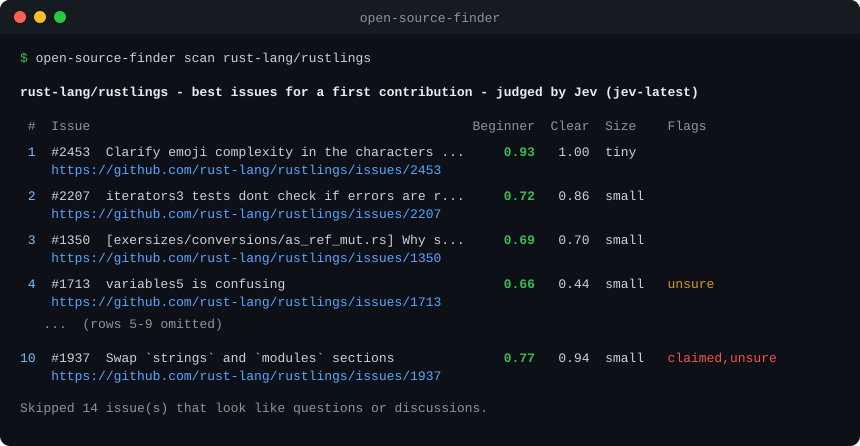
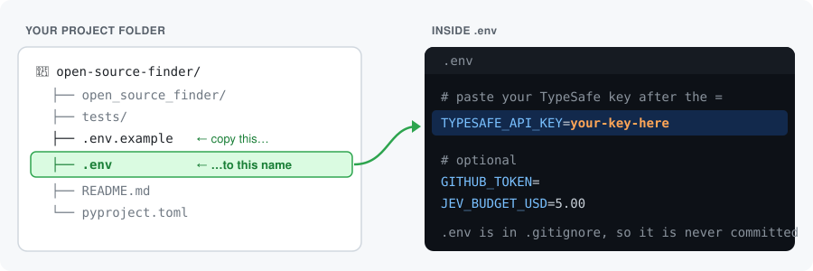
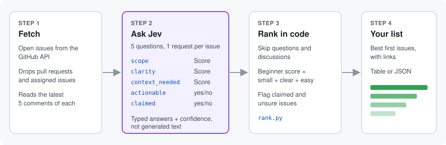

# open-source-finder

**Find the open issues in any GitHub repo that suit a first-time contributor.**

Most repos have dozens of open issues, and only a few are a good first contribution. The
`good first issue` label helps, but it's often missing, out of date, or on issues someone
already took. `open-source-finder` reads each open issue and ranks them by how small, clear, and
self-contained they are. It also flags issues that someone is already working on.



Real output from a scan of [rust-lang/rustlings](https://github.com/rust-lang/rustlings) on
4 October 2026 (rows 5–9 left out). Your results will change as issues are opened and closed.

Built with [Jev](https://docs.typesafe.ai), TypeSafe AI's System One model, which answers
narrow questions with typed, calibrated answers instead of generated text.

> **Note:** This project's code is open source (MIT). Jev itself is a hosted model, so judging
> real issues needs a TypeSafe API key and costs a small amount per issue (see [Cost](#cost)).
> You can try everything else for free with `--mock`.
> This is a community project, not affiliated with TypeSafe AI.

## Install

Requires Python 3.10+.

```bash
git clone https://github.com/Tanishk901/open-source-finder
cd open-source-finder
pip install -e .
```

## Add your API key



1. Get a key from the [TypeSafe console](https://console.typesafe.ai/keys).
2. In the `open-source-finder` folder, copy `.env.example` to a new file named `.env`:

   ```bash
   cp .env.example .env      # macOS / Linux / Git Bash
   copy .env.example .env    # Windows Command Prompt
   ```

3. Open `.env` and replace `paste_your_key_here` with your key:

   ```ini
   TYPESAFE_API_KEY=your-key-here
   ```

`.env` is listed in `.gitignore`, so your key is never committed. Run the tool from the same
folder, because it reads `.env` from the current directory. You can also set
`TYPESAFE_API_KEY` as an environment variable instead.

## Use

```bash
# Try it without any key (keyword rules instead of Jev, much less accurate):
open-source-finder scan pandas-dev/pandas --mock

# With Jev (after adding your key):
open-source-finder scan pandas-dev/pandas --top 10

# Machine-readable output, including every raw judgment:
open-source-finder scan pandas-dev/pandas --json > issues.json
```

| Option | Default | Meaning |
| --- | --- | --- |
| `--top N` | 10 | How many issues to show |
| `--max-issues N` | 30 | How many open issues to fetch and judge (one Jev request each) |
| `--json` | off | Print full results as JSON |
| `--judge` | `jev` | Who judges the issues: `jev` or `mock` |
| `--mock` | off | Shorthand for `--judge mock`: keyword rules, no API key needed |
| `--model` | `jev-latest` | TypeSafe model: `jev-latest` or `jev-preview` |

Set `GITHUB_TOKEN` (in `.env` or your environment) to raise GitHub's rate limit from 60 to
5,000 requests an hour. Without it, keep `--max-issues` small.

## How it works



1. **Fetch** open issues from the GitHub API. Pull requests and assigned issues are dropped,
   and the latest 5 comments are read for each remaining issue.
2. **Judge.** Each issue goes to Jev in one request with five questions that run in parallel:

   | Question | Type | What it asks |
   | --- | --- | --- |
   | `scope` | Score, 5 levels | One-line fix → cross-cutting redesign |
   | `clarity` | Score, 4 levels | Unclear request → outcome, verification, and location all stated |
   | `context_needed` | Score, 4 levels | Newcomer can do it → needs maintainer decisions |
   | `actionable` | Noul (yes/no) | A concrete code/docs/test change, not a question or discussion? |
   | `claimed` | Noul (yes/no) | Do the comments show someone is on it, or that it was declined? |

3. **Rank** in plain code ([`rank.py`](open_source_finder/rank.py)):
   - Issues with `actionable < 0.5` are skipped.
   - The beginner score is `0.4 × small scope + 0.3 × clarity + 0.3 × low context needed`,
     each normalized to 0–1.
   - `claimed > 0.6` → flagged **claimed** and sorted to the bottom.
   - Any Score answered with confidence below 0.5 → flagged **unsure**.
   - The existing `good first issue` label is shown as **gfi-label**, but it doesn't change the
     score, so you can compare Jev's view with the maintainers'.

   Jev answers the questions; the code decides what to do with the answers. To change the
   weights or thresholds, edit the constants at the top of `rank.py`.

## What Jev catches

Real examples from the first scans (October 2026):

- **Already claimed.** In `rust-lang/rustlings`, issue
  [#1937](https://github.com/rust-lang/rustlings/issues/1937) looks perfect for a beginner:
  small, and with a clarity of 0.94. But in its comments the maintainer says, *"I will take care
  of it before releasing v7, no help needed."* Jev flagged it **claimed**, so it was sorted to
  the bottom instead of being recommended.
- **Not a task.** In `fastapi/fastapi`, Jev skipped the pinned "Roadmap" issue and a
  promotional post. Both are open issues, but neither is something a contributor can fix.
- **Better than keywords.** The `--mock` keyword rules gave almost every rustlings issue the
  same score. Jev spread them from 0.30 to 0.93, with a tiny, clearly described docs fix at the
  top.

## Cost

Each judged issue is one Jev request of roughly 1,000–3,000 input tokens (issue bodies are cut
to 3,000 characters, and comments to 500 each). At Jev's listed price of $0.042 per million
input tokens, a 30-issue scan costs well under a cent. Check
[TypeSafe's docs](https://docs.typesafe.ai) for current pricing.

A spending cap is built in. Total spend is tracked in `~/.open-source-finder/spend.json`, and the
run stops before any request that could cross `$5.00` (set `JEV_BUDGET_USD` to change this).

## Roadmap

- [x] Judge issues with Jev
- [ ] Judge issues with local models (e.g. through Ollama), so the tool can run free and offline
- [ ] Compare judges on the same issues, to see which picks the best first contributions

Judges are pluggable. A judge is any class with `judge(repo, issue)` that returns a
[`Judgment`](open_source_finder/rank.py) (the same five answers, normalized to 0–1). To add one,
register it in `JUDGES` and `make_judge()` in [`cli.py`](open_source_finder/cli.py). The ranking
code doesn't change.

## Development

```bash
pip install -e ".[test]"
pytest
```

The tests cover the ranking policy, conversion of SDK responses, and the budget cap. They use no
network and need no API key.

## Credits

- [TypeSafe Python SDK](https://github.com/typesafe-ai/typesafe-sdk-python) (MIT)
- The budget helper is adapted from [jev-starter-examples](https://github.com/Tanishk901/jev-starter-examples)
- More Jev projects: [awesome-jev](https://github.com/heyjunpenn/awesome-jev) / [jevbest.com](https://jevbest.com)

## License

[MIT](LICENSE)
